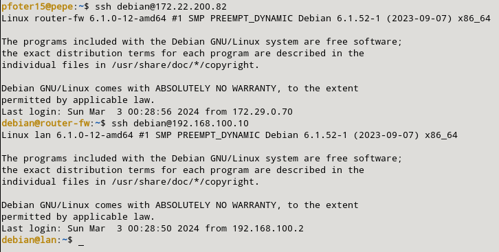

### a) Permite poder hacer conexiones ssh al exterior desde la máquina cortafuegos.

Primero, deberemos instalar el paquete de nftables con el siguiente comando:

```sql
sudo apt install nftables
sudo systemctl start nftables
sudo systemctl enable nftables
```

Tras esto crearemos una nueva tabla que se hará mediante este comando:

```sql
sudo nft add table inet filter
```

Tras esto, creamos la reglas mediante nftables para poder acceder mediante la máquina lan hacia afuera mediante ssh. Estas reglas son las siguientes:

```sql
sudo nft add chain inet filter input { type filter hook input priority 0 \; counter \; policy accept \; }
sudo nft add chain inet filter output { type filter hook output priority 0 \; counter \; policy accept \; }
sudo nft add chain inet filter forward { type filter hook forward priority 0 \; counter \; policy accept \; }

sudo nft add rule inet filter output oifname "ens3" tcp dport 22 ct state new,established accept
sudo nft add rule inet filter input iifname "ens3" tcp sport 22 ct state established accept

sudo nft add chain inet filter input { type filter hook input priority 0 \; counter \; policy drop \; }
sudo nft add chain inet filter output { type filter hook output priority 0 \; counter \; policy drop \; }
sudo nft add chain inet filter forward { type filter hook forward priority 0 \; counter \; policy drop \; }
```

Para ver que se han creado las reglas ejecutaremos este comando:

```sql
sudo nft list ruleset
```


Por último, para comprobar el acceso al exterior mediante mi máquina lan accediendo por ssh a mi máquina de odin.

