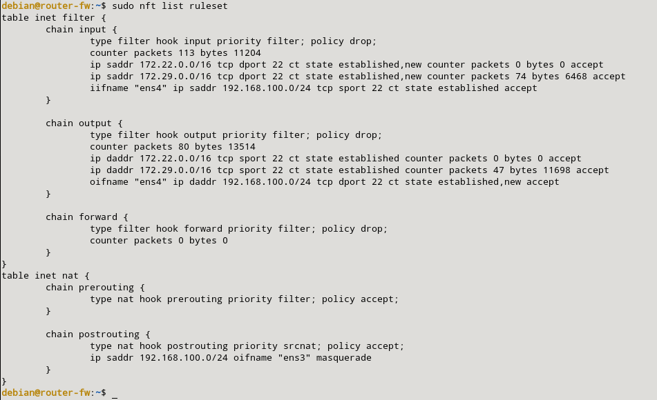
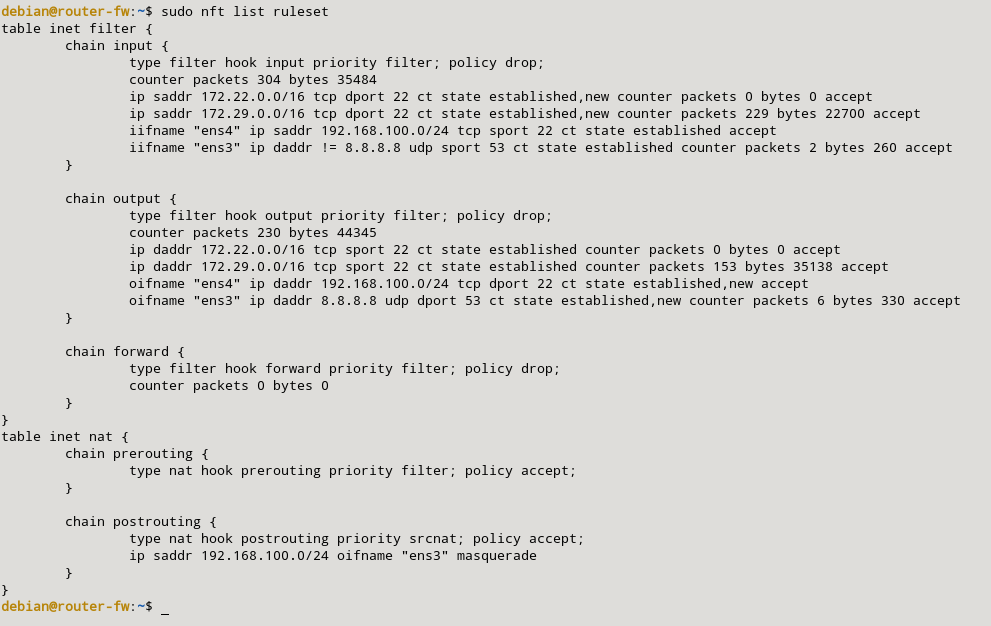

### a) Permite poder hacer conexiones ssh al exterior desde la máquina cortafuegos.

Primero levantararemos el escenario, y cuando lo levantemos tendremos que acceder a la máquina de vagrant para que tenga la salida por defecto la de la red de vagrant. Para ello, ejecutaremos el siguiente comando:

```sql
sudo ip route del default via 192.168.121.1
sudo ip route add default via 192.168.100.2
```



Con esto, no tendremos conexión externa de nuestra máquina mediante esta red. Con esto, pasamos a la configuración del servidor router. Primero deberemos activar el bit de forwarding en el router:

```sql
sudo echo 1 > /proc/sys/net/ipv4/ip_forward
```

Para poder permitir conexiones, primero, deberemos instalar el paquete de nftables con el siguiente comando:

```sql
sudo apt update
sudo apt install nftables
sudo systemctl start nftables
sudo systemctl enable nftables
```

Tras esto crearemos una nueva tabla que se hará mediante este comando:

```sql
sudo nft add table inet filter
sudo nft add table inet nat
```

Tras esto, creamos la reglas mediante nftables para poder acceder mediante ssh a la máquina router y también a red local en la cual se ubica mi máquina lan. Primero, crearemos en la tabla nat y las cadenas post y prerouting (la cuales tenemos que añadir la regla snat para que salga la red). Cuando lo tengamos, creamos un filtro el cual ponemos la política por defecto en accept, aplicamos las reglas de ssh para que no perdamos la conexión y seguido de esto la ponemos en drop. Estas reglas son las siguientes:

```sql
sudo nft add chain inet nat prerouting { type nat hook prerouting priority 0 \; }
sudo nft add chain inet nat postrouting { type nat hook postrouting priority 100 \; }

sudo nft add rule inet nat postrouting ip saddr 192.168.100.0/24 oifname "eth0" masquerade

sudo nft add chain inet filter input { type filter hook input priority 0 \; counter \; policy accept \; }
sudo  nft add chain inet filter output { type filter hook output priority 0 \; counter \; policy accept \; }
sudo  nft add chain inet filter forward { type filter hook forward priority 0 \; counter \; policy accept \; }

sudo nft add rule inet filter input ip saddr 192.168.121.0/24 tcp dport 22 ct state new,established counter accept
sudo  nft add rule inet filter output ip daddr 192.168.121.0/24 tcp sport 22 ct state established counter accept

sudo  nft chain inet filter input { policy drop \; }
sudo  nft chain inet filter output { policy drop \; }
sudo  nft chain inet filter forward { policy drop \; }
```

Para ver que se han creado las reglas ejecutaremos este comando:

```sql
sudo nft list ruleset
```


Y comprobamos que nos accedea nuestra máquina router:

