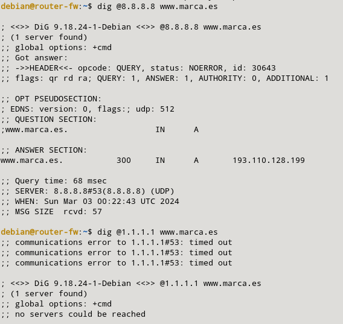
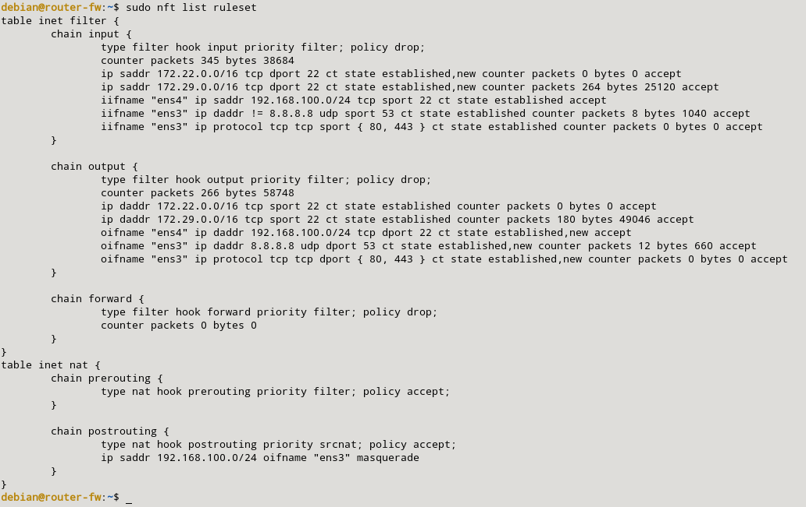

### b) Permite hacer consultas DNS desde la máquina cortafuegos sólo al servidor 8.8.8.8. Comprueba que no puedes hacer un dig @1.1.1.1.

Para poder realizar consultas desde la máquina de corta fuegos solo al servidor 8.8.8.8, deberemos crear las siguientes reglas:

```sql
sudo nft add rule inet filter output oifname "eth0" ip daddr 8.8.8.8 udp dport 53 ct state new,established counter accept
sudo nft add rule inet filter input iifname "eth0" ip daddr != 8.8.8.8 udp sport 53 ct state established counter accept
```

Esta reglas nos aceptan el tráfico a las peticiones a nuestro servidor DNS que es 8.8.8.8 y si no es ese el servidor, lo rechaza. Las reglas quedarán de esta manera:



Para hacer la prueba, haremos la petición a nuestro servidor sobre www.marca.es y veremos que nos muestra respuesta. También veremos que si lo hacemos a otro, nos dará fallo (como por ejemplo 1.1.1.1).

