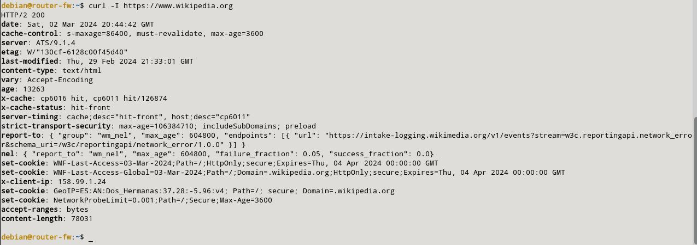

### c) Permite que la máquina cortafuegos pueda navegar por https.

Para poder permitir que la máquina cortafuegos pueda navegar por https, deberemos añadir el siguiente comando con esta regla:

```sql
sudo nft add rule inet filter output oifname "ens3" ip protocol tcp tcp dport { 80,443 } ct state new,established counter accept
sudo nft add rule inet filter input iifname "ens3" ip protocol tcp tcp sport { 80,443 } ct state established counter accept
```

Cuando lo tengamos, pasamos a ver que se ha creado correctamente.


Para comprobar que funciona correctamente, le hecho una petición a wikipedia mediante este protocolo y vemos que funciona de manera correcta y adecuada:

