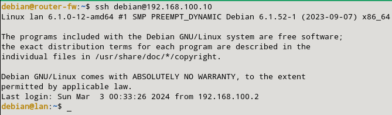

### d) Los equipos de la red local deben poder tener conexión al exterior.

Para que todos los equipos de la red local, con rango 192.168.100.0/24, tenga conexión al exterior tendremos que añadir la siguiente regla:

```sql
sudo nft add rule inet filter forward iifname "eth1" oifname "eth0" ip saddr 192.168.100.0/24 icmp type echo-request counter accept
sudo nft add rule inet filter forward iifname "eth0" oifname "eth1" ip daddr 192.168.100.0/24 icmp type echo-reply counter accept
```

Cuando lo tengamos, pasamos a ver que se ha creado correctamente.


Para comprobar que funciona correctamente, le hecho un simple ping a 8.8.8.8 desde mi máquina LAN para ver si tengo conexión:

