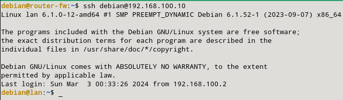

### e) Permitimos el ssh desde el cortafuegos a la LAN.

Para este apartado, tendremos que permitir mediante el cortafuegos acceder por ssh a la máquina LAN. Para ello, aplicaremos la siguiente regla (la tenemos hecha en el primer ejercicio):

```sql
sudo nft add rule inet filter output oifname "ens4" ip daddr 192.168.100.0/24 tcp dport 22 ct state new,established counter accept
sudo nft add rule inet filter input iifname "ens4" ip saddr 192.168.100.0/24 tcp sport 22 ct state established counter accept
```

Como las reglas ya esta puesta, comprobamos que nos accede desde el router al servidor para ver que funciona esta regla:

