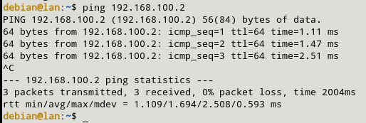

### e) Permitimos el ssh desde el cortafuegos a la LAN.

Para este apartado, tendremos que permitir mediante el cortafuegos acceder por ssh a la máquina LAN. Para ello, aplicaremos la siguiente regla:

```sql
sudo nft add rule inet filter output oifname "eth1" ip daddr 192.168.100.0/24 tcp dport 22 ct state new,established counter accept
sudo nft add rule inet filter input iifname "eth1" ip saddr 192.168.100.0/24 tcp sport 22 ct state established counter accept
```

Cuando lo tengamos, pasamos a ver que se ha creado correctamente.


Para comprobar que funciona correctamente, primero tendremos que copiar la clave de vagrant de máquina LAN al authorized_keys de mi máquina cortafuegos, seguido de esto, accedemos mediante ssh desde el cortafuegos a la LAN. 

El comando que he utilizado para copiar es el siguiente y despues el segundo, guarda la clave en el fichero authorized_keys en mi máquina router:

```sql
scp -i .vagrant/machines/router_fw/libvirt/private_key  .vagrant/machines/lan/libvirt/private_key vagrant@192.168.121.25:.ssh/
cd .ssh/
mv private_key clave_lan
ssh -i clave_lan vagrant@192.168.100.10
```

