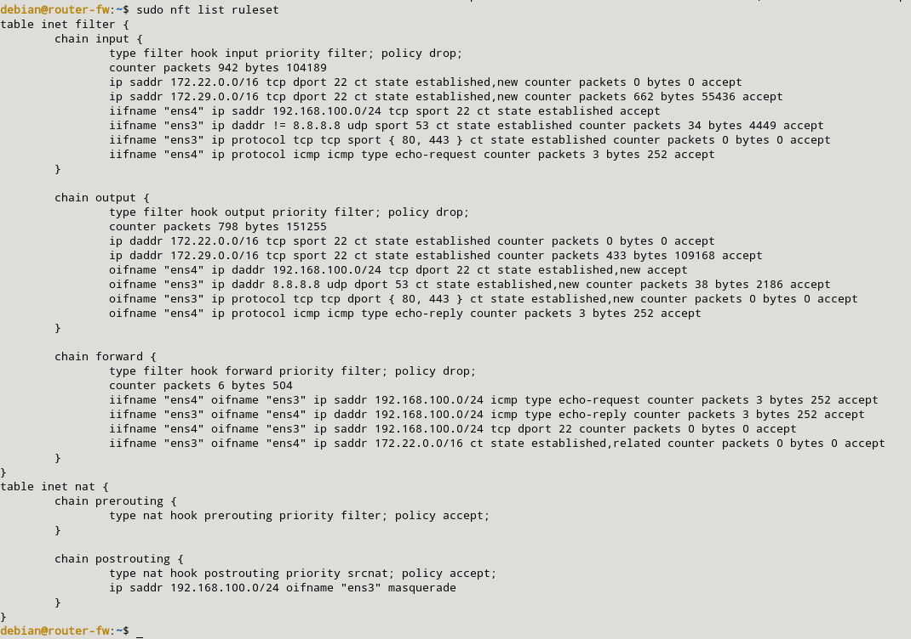
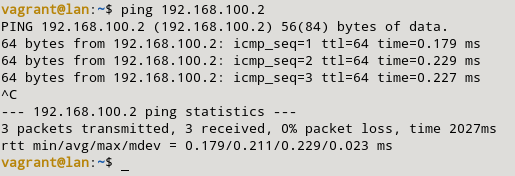

### f) Permitimos hacer ping desde la LAN a la máquina cortafuegos.

Para poder hacer ping desde mi máquina LAN a mi máquina cortafuegos, tendremos que habilitar las siguientes reglas: 

```sql
sudo nft add rule inet filter input iifname "eth1" ip protocol icmp icmp type echo-request counter accept
sudo nft add rule inet filter output oifname "eth1" ip protocol icmp icmp type echo-reply counter accept
```

Las reglas quedarán de la siguiente manera:



La prueba de que este cortafuegos funciona:

