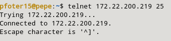

### g) Permite realizar conexiones ssh desde los equipos de la LAN.

Para poder ssh a alguna máquina del mismo exterior (por ejemplo en mi caso he hecho que funcione el ssh a las máquinas de las red de vagrant), tendremos que añadir las siguientes reglas:

```sql
sudo nft add rule inet filter forward iifname "eth1" oifname "eth0" ip saddr 192.168.100.0/24 tcp dport 22 counter accept
sudo nft add rule inet filter forward iifname "eth0" oifname "eth1" ip saddr 192.168.121.0/24 ct state established,related counter accept
```

Las reglas quedarán de la siguiente manera:


La prueba de que este cortafuegos funciona accediendo a mi host:

