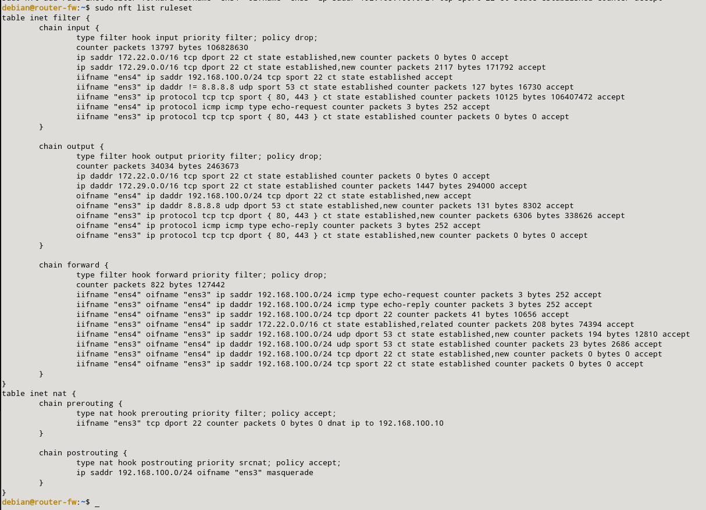
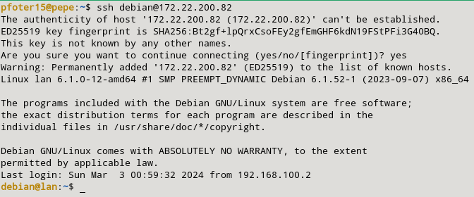

### h) Instala un servidor de correos en la máquina de la LAN. Permite el acceso desde el exterior y desde el cortafuegos al servidor de correos. Para probarlo puedes ejecutar un telnet al puerto 25 tcp.

Como nos pide que instalamos un servidor de correos en nuetra máquina LAN, lo que haremos será instalar postfix en dichha máquina primero de todo. Los comandos son los siguientes:

```sql
sudo apt update
sudo apt install postfix 
```

Cuando lo tengamos habilitamos las peticiones en el puerto 25 con las siguientes reglas:

```sql
sudo nft add rule inet filter forward iifname "eth1" oifname "eth0" tcp dport 25 counter accept
sudo nft add rule inet filter forward iifname "eth0" oifname "eth1" tcp sport 25 counter accept
```

Las reglas quedarán de la siguiente manera:



La prueba de que este cortafuegos funciona será haciendo desde mi host una petición a mi máquina LAN:

