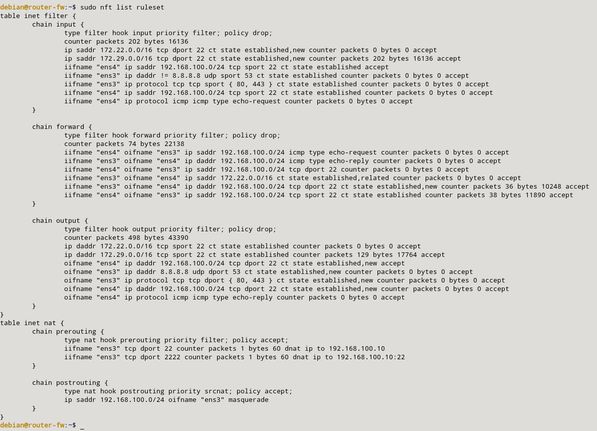
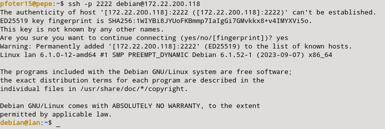

### j) Modifica la regla anterior, para que al acceder desde el exterior por ssh tengamos que conectar al puerto 2222, aunque el servidor ssh este configurado para acceder por el puerto 22.

Para poder acceder desde el exterior para poder por ssh tengamos que conectar al puerto 2222, aunque el servidor ssh este configurado para acceder por el puerto 22, tendremos que añadir la siguiente regla:  

```sql
sudo nft add rule inet nat prerouting iifname "ens3" tcp dport 2222 counter dnat ip to 192.168.100.10:22
```

Las reglas quedarán de la siguiente manera:



La prueba de que este cortafuegos funciona será haciendo desde mi host una petición a mi máquina LAN mediante el puerto 2222:

