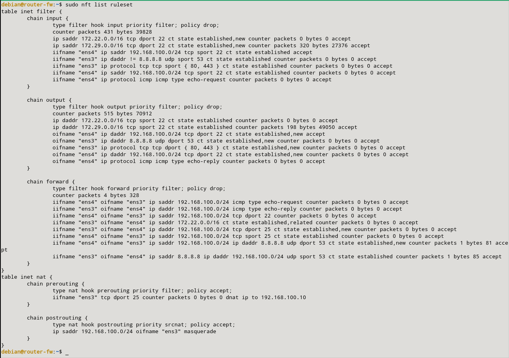
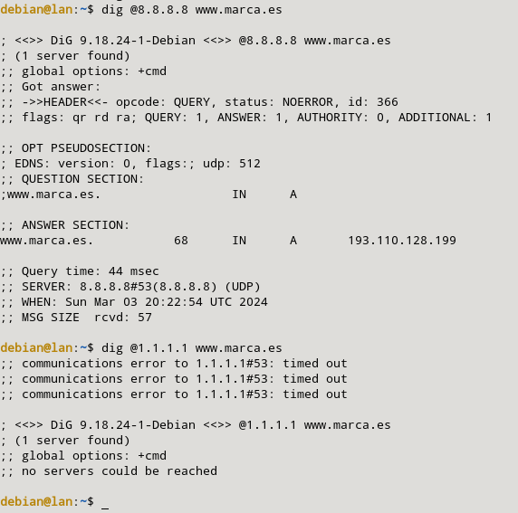

### k) Permite hacer consultas DNS desde la LAN sólo al servidor 8.8.8.8. Comprueba que no puedes hacer un dig @1.1.1.1.

Para poder permitir hacer consultas DNS desde la LAN sólo al servidor 8.8.8.8, tendremos que añadir las siguientes reglas:

```sql
sudo nft add rule inet filter forward iifname "ens4" oifname "ens3" ip saddr 192.168.100.0/24 ip daddr 8.8.8.8 udp dport 53 ct state new,established counter accept
sudo nft add rule inet filter forward iifname "ens3" oifname "ens4" ip saddr 8.8.8.8 ip daddr 192.168.100.0/24 udp sport 53 ct state established counter accept
```

Las reglas quedarán de la siguiente manera:



Para hacer la prueba, haremos la petición a nuestro servidor sobre www.marca.es y veremos que nos muestra respuesta. También veremos que si lo hacemos a otro, nos dará fallo (como por ejemplo 1.1.1.1).

