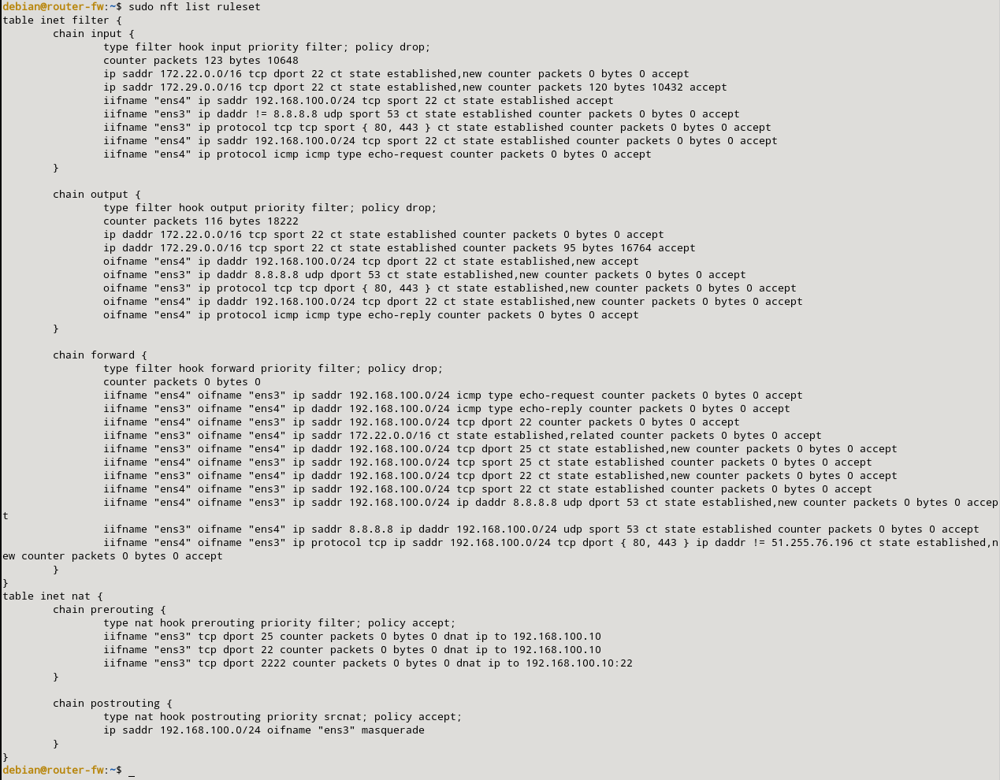
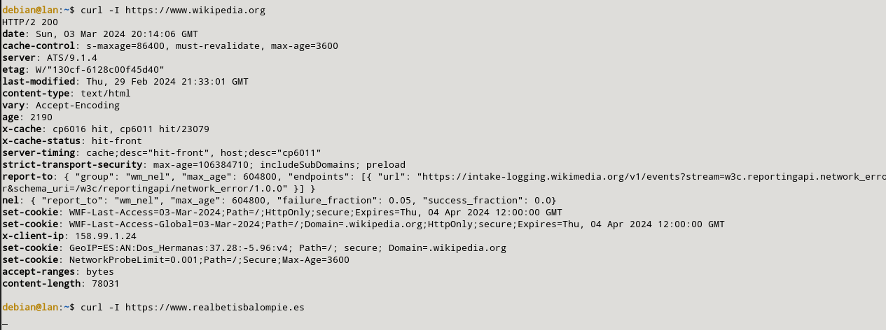

### l) Permite que los equipos de la LAN puedan navegar por internet, excepto a la página www.realbetisbalompie.es

Para poder permitir que los equipos de la LAN puedan navegar por internet, excepto a la página www.realbetisbalompie.es, tendremos que añadir la siguiente regla:

```sql
sudo nft add rule inet filter forward iifname "ens4" oifname "ens3" ip protocol tcp ip saddr 192.168.100.0/24 tcp dport { 80,443} ip daddr != { 51.255.76.196 } ct state new,established counter accept
```

Todas las reglas quedarán de la siguiente manera:



Para hacer la prueba, haremos la petición a nuestro servidor sobre www.wikipedia.org y veremos que nos muestra respuesta. También veremos que si lo hacemos a la página del www.realbetisbalompie.es no nos dará respuesta:

